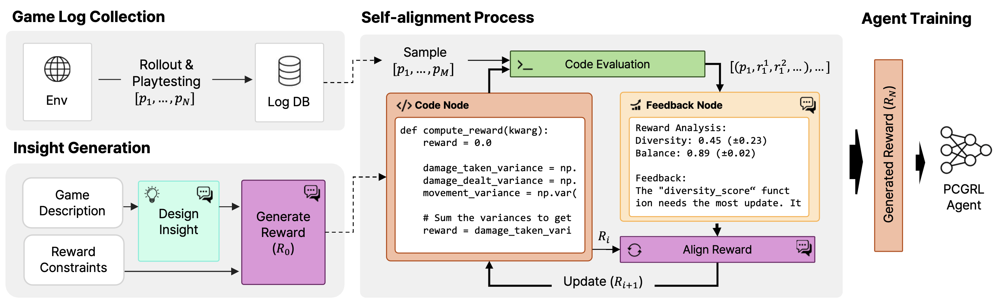

# ChatPCG: Large Language Model-driven Reward Design for Procedural Content Generation

This repository contains the prompts used in the ChatPCG project, which aims to develop a large language model (LLM) for procedural content generation (PCG) task.



- `System` - The system section contains the system prompt, which is the task description for the user to complete.
- `User` - The user section contains the task, example code, playtest result example, insights, and reward function for the user to complete.
- `Assistant` - The assistant section contains the generated prompt by the LLM for the user to continue the task.

## System Prompt (Step 1)

### PCG Agent Reward Function Generation Task

You are a reward function engineer trying to write reward functions to solve reinforcement learning tasks as effective as possible.
The PCG agent is an agent that balances the game environment by adjusting the setting of the game variables related to the game difficulty.
The adjustable variables are health, armor, and speed of the player agents and range, cooldown, and damage of the players's attack skill.
The action of the PCG agent revise the player property value, which is one of four players, to balance the game difficulty and the reward function evaluates the game difficulty based on the playtested results.
The state of the agent is current game setting values and the action is adjustment of the game setting values.
On every episode, the game setting values are initialized randomly and the PCG agent adjusts the game setting values to achieve the target win rate.
The agent gets the reward signal from the reward function you write and learns to adjust the game setting values to achieve the goal of the reward function.

### The Raid Game Environment

The game environment is a multiplayer game where player agents fight against a boss agent (i.e., boss raid game).
There are four ally player agents and one boss agent in the game and the goal of the player agents is to defeat the boss agent.
On the beginning of the simulation, the game setting values are deployed to the game environment and the player agents and the boss agent are spawned at random locations on the map.
Next, the environment starts game and repeats the game by an arbitrary number (e.g., 100) of episodes to simulate the deployed game settings.
On the end of the simulation, the environment collects, calculates, and store the playtested results via an output file.

### Variable Reference

In this section, the variables that the reward function can access are described.
The reward function only can access the key listed below. If the key is not listed below, the reward function cannot access the value.
The common variables are the variables that are measured for the overall game state, not for each player.
The individual variables are the variables that are measured for each player in the game state.

### Individual Variables

- `Playtesting.Agent{i}.SurviveTime` - The survival time of Agent {i} during playtesting.
- `Playtesting.Agent{i}.Distance.Moved.PerSecond` - The average distance moved per second by Agent {i}.
- `Playtesting.Agent{i}.Distance.Boss.Mean` - The average distance of Agent {i} from the boss entity.
- `Playtesting.Agent{i}.Damage.Dealt.PerSecond` - The average damage dealt per second by Agent {i}.
- `Playtesting.Agent{i}.Damage.Taken.PerSecond` - The average damage taken per second by Agent {i}.
- `Playtesting.Agent{i}.Armored.PerSecond` - The change in armor status per second for Agent {i}.
- `Playtesting.Agent{i}.Health.Last.Ratio` - The ratio of Agent {i}'s last health value to its maximum health.
- `Playtesting.Agent{i}.Skill.Used.PerSecond` - The average usage of the specific skill per second by Agent {i}.

The playtested values are min-max normalized for each variable. The values are normalized to the range of [0, 1].
There are four player agents in the game and the index of the player agent is from 0 to 3. (e.g., Agent0, Agent1, Agent2, Agent3)
The example of the key name is "`Playtesting.Agent0.SurviveTime`" for the survival time of Agent0.

### Reward Function

The reward function is a function that calculates the reward value for the agent based on the playtested results.
The function is written in Python and loads the playtested results from the json file and calculates the reward value based on the results.

```python
import json
import sys
import numpy as np


def compute_reward(kwarg):
    reward = 0.0

    # start of code
    def reward_1(kwarg):
        return 0.0

    def reward_2(kwarg):
        return 0.0

    def reward_3(kwarg):
        return 0.0


    reward = reward_1(kwarg) + reward_2(kwarg) + reward_3(kwarg)
    # end of code

    return reward


if __name__ == "__main__":
    try:
        json_path = sys.argv[1]

        with open(json_path, 'r') as f:
            kwarg = json.load(f)

        reward = compute_reward(kwarg)
        print(reward)
    except IndexError:
        print("Error: No argument provided.")
```

This is the template of the reward function.
The 'compute_reward' function is composed by summing the results from multiple reward terms, such as reward_1, reward_2 ...
Similar to the template provided, it is necessary to create functions within the function, and the number of functions does not matter.
The function receives the playtested results and returns the reward value in float.
The function should be implemented in the "compute_reward" function.
The reward shaping code should be written between '# start of code' and '# end of code' comments.
The code output should be formatted as a Python code string: "`python ... `".

## Reward Generation via Prompt Engineering (PE) Techniques (Step 2)

### Self-Alignment Process

- The `Iteration` columns denote the number of iteration in the self-alignment process.
- `IO` have no self-alignment process from the initial reward function. The game log data was used to generate the first reward function, however, the reward function was not updated through the self-alignment process.
- `CoT` have iterations of the self-alignment process. The game log data was used to generate an updated reward function through the self-alignment process.

| PE    | Insight<br>Generation                                                | Iteration 1                                                          | Iteration 2                                                            | Iteration 3                                                            | Iteration 4                                                            | Iteration 5<br>(**Result**)                                            |
| :---- | :------------------------------------------------------------------- | -------------------------------------------------------------------- | ---------------------------------------------------------------------- | ---------------------------------------------------------------------- | ---------------------------------------------------------------------- | ---------------------------------------------------------------------- |
| `IO`  | [_Link_](./IO/reward_IO.md#insights-1)                        | N/A                                                                  | N/A                                                                    | N/A                                                                    | N/A                                                                    | [_Link_](./IO/reward_IO.md#reward-function-2)                          |
| `CoT` | [_Link_](./CoT/reward_2024-04-08-15-15-43.json.md#insights-1) | [_Link_](./CoT/reward_2024-04-08-15-15-43_0.json.md#reward-function-2) | [_Link_](./CoT/reward_2024-04-08-15-15-43_1.json.md#reward-function-2) | [_Link_](./CoT/reward_2024-04-08-15-15-43_2.json.md#reward-function-2) | [_Link_](./CoT/reward_2024-04-08-15-15-43_3.json.md#reward-function-2) | [_Link_](./CoT/reward_2024-04-08-15-15-43_4.json.md#reward-function-2) |

### CoT-Generated Reward Function

```python
import json
import sys
import numpy as np

def compute_reward(kwarg):
    reward = 0.0

    # start of code

    def diversity_score(kwarg) -> float:
        # Redefined diversity calculation to take into account the mean of the diversity scores instead of the minimum.
        # This change aims to better reward scenarios where there's considerable diversity in at least some aspects.
        metrics = ['Skill.Used.PerSecond', 'Distance.Moved.PerSecond', 'Damage.Dealt.PerSecond', 'Damage.Taken.PerSecond']
        diversity_scores = []

        for metric in metrics:
            values = np.array([kwarg[f'Playtesting.Agent{i}.{metric}'] for i in range(4)])
            diversity_range = np.ptp(values)
            max_diversity_range = 1  # Since values are normalized to [0, 1], max range is 1
            normalized_diversity = diversity_range / max_diversity_range  # Normalize diversity to [0, 1]
            diversity_scores.append(normalized_diversity)

        # Calculating the mean diversity score to appreciate overall diversity rather than penalizing based on the least diverse metric.
        total_diversity = np.mean(diversity_scores)

        return total_diversity

    def performance_balance(kwarg) -> float:
        # Balance based on survival time and damage dealt remains unchanged.
        survival_time_balance = np.std([kwarg[f'Playtesting.Agent{i}.SurviveTime'] for i in range(4)])
        damage_dealt_balance = np.std([kwarg[f'Playtesting.Agent{i}.Damage.Dealt.PerSecond'] for i in range(4)])

        balance = 1 - ((survival_time_balance + damage_dealt_balance) / 2)

        return balance

    diversity = diversity_score(kwarg)
    balance = performance_balance(kwarg)

    # Considering the importance of both diversity and balance for a fun multiplayer game experience,
    # the weights are kept unchanged to ensure a good balance between these two aspects.
    reward = (diversity * 0.7) + (balance * 0.3)

    # Ensure the reward remains within the designated range of [0, 1].
    reward = np.clip(reward, 0, 1)

    # end of code

    return reward

if __name__ == "__main__":
    try:
        json_path = sys.argv[1]

        with open(json_path, 'r') as f:
            kwarg = json.load(f)

        reward = compute_reward(kwarg)
        print(reward)
    except IndexError:
        print("Error: No argument provided.")
```
